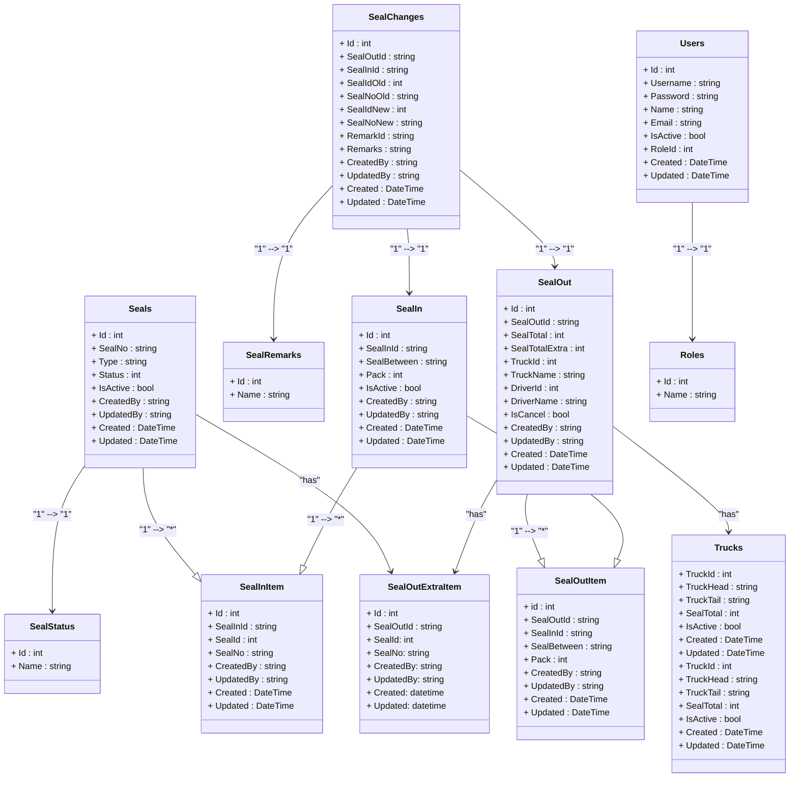

```mermaid
classDiagram
    class Seals {
        + Id : int
        + SealNo : string
        + Type : string
        + Status : int
        + IsActive : bool
        + CreatedBy : string
        + UpdatedBy : string
        + Created : DateTime
        + Updated : DateTime
    }
    class SealOutExtraItem {
        + Id : int
        + SealOutId : string
        + SealId: int
        + SealNo: string
        + CreatedBy: string
        + UpdatedBy: string
        + Created: datetime
        + Updated: datetime
    }
    class SealStatus {
        + Id : int
        + Name : string
    }
    class SealRemarks {
        + Id : int
        + Name : string
    }
    class SealChanges {
        + Id : int
        + SealOutId : string
        + SealInId : string
        + SealIdOld : int
        + SealNoOld : string
        + SealIdNew : int
        + SealNoNew : string
        + RemarkId : string
        + Remarks : string
        + CreatedBy : string
        + UpdatedBy : string
        + Created : DateTime
        + Updated : DateTime
    }
    
    class SealIn {
        + Id : int
        + SealInId : string
        + SealBetween : string
        + Pack : int
        + IsActive : bool
        + CreatedBy : string
        + UpdatedBy : string
        + Created : DateTime
        + Updated : DateTime
    }

    class SealInItem {
        + Id : int
        + SealInId : string
        + SealId : int
        + SealNo : string
        + CreatedBy : string
        + UpdatedBy : string
        + Created : DateTime
        + Updated : DateTime
    }

    class SealOut {
        + Id : int
        + SealOutId : string
        + SealTotal : int
        + SealTotalExtra : int
        + TruckId : int
        + TruckName : string
        + DriverId : int
        + DriverName : string
        + IsCancel : bool
        + CreatedBy : string
        + UpdatedBy : string
        + Created : DateTime
        + Updated : DateTime
    }

    class SealOutItem {
        + id : int
        + SealOutId : string
        + SealInId : string
        + SealBetween : string
        + Pack : int
        + CreatedBy : string
        + UpdatedBy : string
        + Created : DateTime
        + Updated : DateTime
    }
    class Users {
        + Id : int
        + Username : string
        + Password : string
        + Name : string
        + Email : string
        + IsActive : bool
        + RoleId : int
        + Created : DateTime
        + Updated : DateTime
    }

    class Roles {
        + Id : int
        + Name : string
    }
   class Trucks {
        + TruckId : int
        + TruckHead : string
        + TruckTail : string
        + SealTotal : int
        + IsActive : bool
        + Created : DateTime
        + Updated : DateTime
    }
    class Trucks {
        + TruckId : int
        + TruckHead : string
        + TruckTail : string
        + SealTotal : int
        + IsActive : bool
        + Created : DateTime
        + Updated : DateTime
    }
SealIn --|> SealInItem : "1" --> "*"
SealIn --|> SealOutItem : "1" --> "*"
SealOut --|> SealOutItem : "1" --> "*"
Seals --|> SealInItem : "1" --> "*"
Users --> Roles : "1" --> "1"
Seals --> SealStatus : "1" --> "1"
SealChanges  --> SealIn : "1" --> "1"
SealChanges  --> SealOut : "1" --> "1"
SealChanges  --> SealRemarks : "1" --> "1"
SealOut --> Trucks : "has"
SealOut --> SealOutExtraItem : "has"
Seals --> SealOutExtraItem : "has"
```